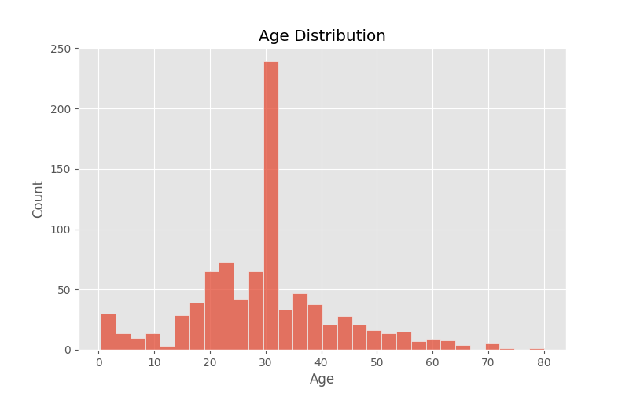
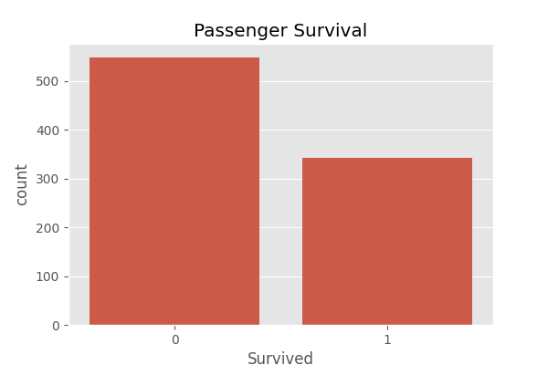
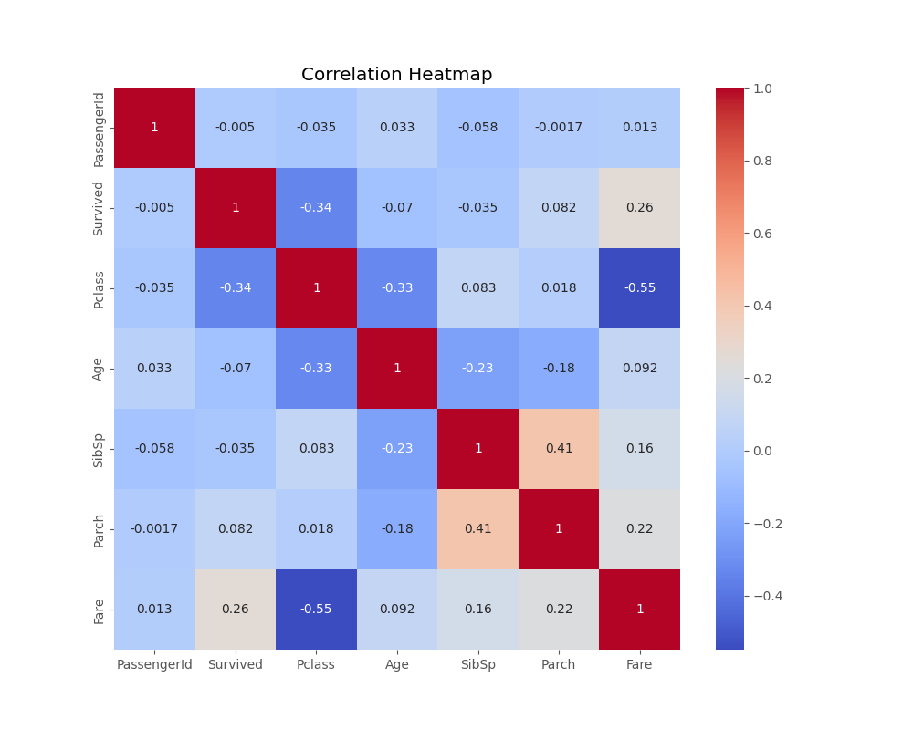
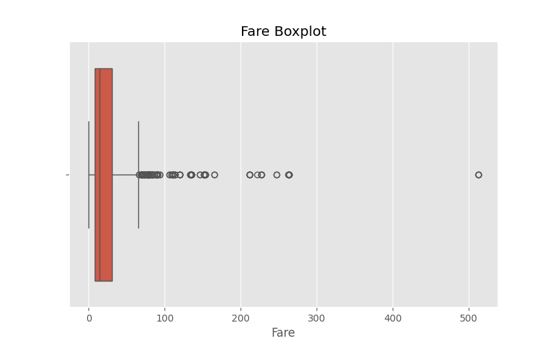
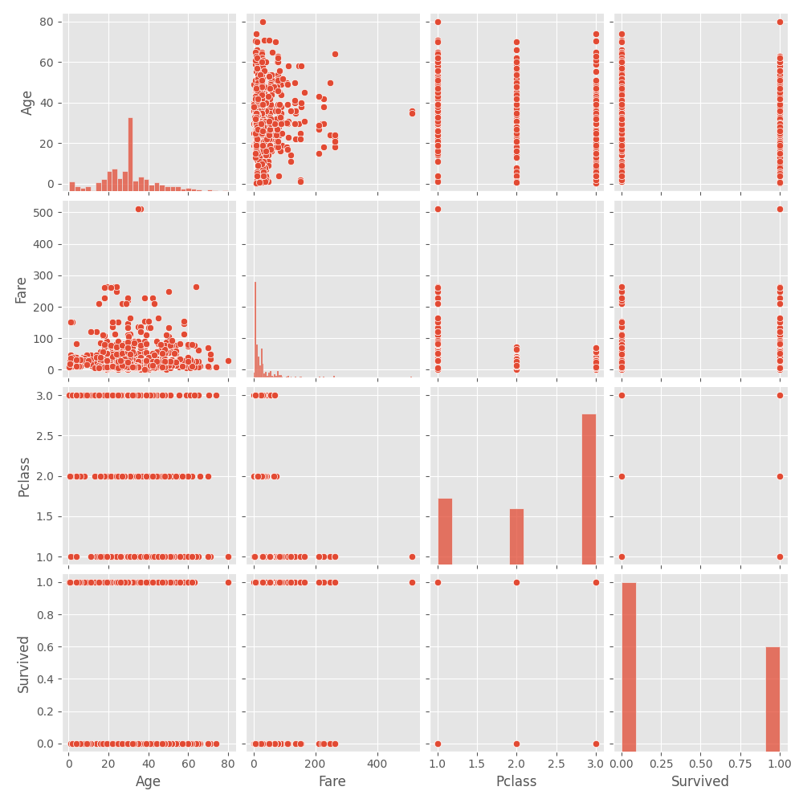

# 📊 Exploratory Data Analysis (EDA) Project


---

## 📌 Overview

This project performs Exploratory Data Analysis (EDA) on the Titanic dataset to uncover patterns, trends, and insights using statistical summaries and visualizations.

---

## 🚀 Tools & Libraries

- Python
- Pandas
- NumPy
- Matplotlib
- Seaborn

---

## 📊 Analysis Performed

- Data overview
- Missing value handling
- Statistical summary
- Age distribution
- Fare distribution
- Passenger survival analysis
- Correlation heatmap
- Boxplot
- Pairplot

---

## 📈 Visualizations

### Age Distribution



---

### Passenger Survival



---

### Fare Distribution


---

### Correlation Heatmap



---

### Fare Boxplot



---

### Pairplot



---

## 📂 Project Structure

```
Exploratory-Data-Analysis-Project
│
├── data/
│   └── titanic.csv
│
├── images/
│   ├── age_distribution.png
│   ├── survival_count.png
│   ├── fare_distribution.png
│   ├── correlation_heatmap.png
│   ├── boxplot_fare.png
│   └── pairplot.png
│
├── exploratory_data_analysis.ipynb
├── requirements.txt
└── README.md
```

---

## 🔍 Key Insights

- Most passengers were between 20–40 years old.
- Higher fares were generally associated with higher-class passengers.
- Female passengers showed a higher survival rate.
- There is a noticeable relationship between Fare and Passenger Class.
- Missing values were handled before analysis.

---

## 👩‍💻 Author

**Asifa Firdhouse**

Artificial Intelligence & Machine Learning Student

⭐ If you found this project useful, consider giving it a star!
